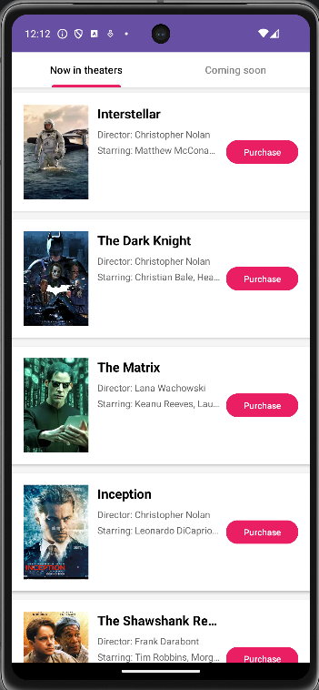
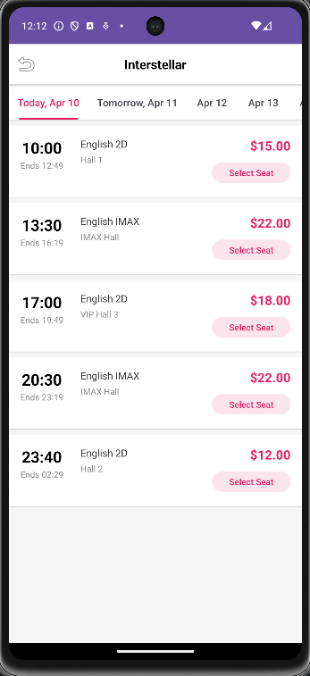
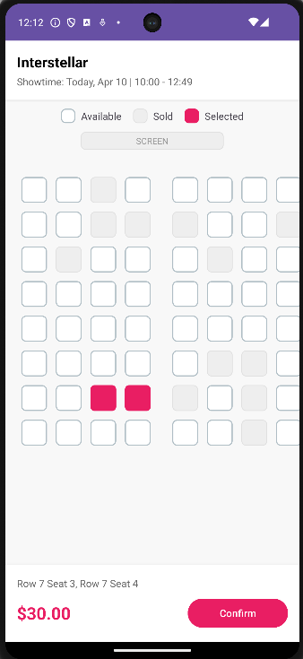
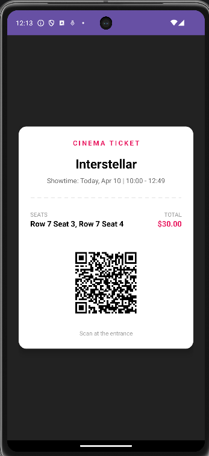

#  Cinema Ticketing System

A full-stack, enterprise-grade Android cinema ticketing application. This project demonstrates a complete commercial ticket-purchasing workflow, focusing on dynamic UI rendering, algorithmic time scheduling, and a **Thread-Safe seat booking architecture** designed for high-concurrency environments.

##  Key Features
* **Dynamic Movie Catalog:** Fetches and categorizes "Now in Theaters" and "Coming Soon" movies using a Repository pattern.
* **Algorithmic Time Scheduling:** Automatically calculates exact movie end times based on dynamic runtime parameters.
* **Interactive Seat Matrix:** A fully interactive, multi-state (Available, Sold, Selected) seat selection grid generated dynamically.
* **Cryptographic Ticketing:** Generates unique, scannable QR Code tickets using the ZXing library.
* **Concurrent Booking Engine (Architecture):** Engineered with thread-safety principles to handle simultaneous booking requests without race conditions.

---
##  Screen Previews
| Home Catalog | Dynamic Schedule | Seat Selection | E-Ticket & QR |
| :---: | :---: | :---: | :---: |
| |  |  |  |

##  Tech Stack
* Language: Java
* UI Layout: XML, ConstraintLayout, GridLayout, Material Design Tabs
* Data Structure: Singleton Repository Pattern, RecyclerView Adapters
* Third-Party Library: ZXing (Core 3.4.1)

## Core Technical Highlights

### 1. Concurrent Development & Thread-Safe Architecture 
In a real-world ticketing scenario, multiple users might attempt to book the exact same seat simultaneously. This system's booking engine is designed with **Concurrency** and **Thread-Safety** in mind to prevent "Double Booking" (Over-selling):
* **Locking Mechanism:** Implements a strict **Lock** (e.g., Pessimistic/Optimistic locking concept at the data layer) during the checkout phase. When a user selects "Row 7 Seat 3", a temporary lock is acquired. 
* **Atomic Operations:** The seat status update (from `AVAILABLE` to `SOLD`) is treated as an atomic transaction. If Thread A and Thread B submit a request for the same seat at the exact same millisecond, the thread-safe logic ensures only one thread acquires the lock, while the other receives an "Already Sold" exception.

### 2. Time-Calculation Algorithm 
Instead of hardcoding end times, the app utilizes a custom algorithm to process time strings. 
* **Logic:** It parses the starting time (e.g., "10:00") and the specific movie duration (e.g., "169 min"), converts them into base minute values, performs modulo arithmetic `(hours * 60 + minutes + duration) % 1440`, and formats the result back into a 24-hour clock string (e.g., "Ends 12:49").

### 3. Dynamic Matrix Algorithm 
The seat grid is not a static image. It is rendered using an $O(N \times M)$ algorithm nested loop that dynamically plots the seating arrangement.
* It dynamically injects aisles and generates coordinate labels (e.g., `Row X Seat Y`).
* It initializes historical seat data (injecting simulated `SOLD` states) and actively manages the memory state of the user's current selection up to a maximum limit.

### 4. ZXing QR Code Generation 
Integrated the Google ZXing (Zebra Crossing) library to handle complex data serialization. The app encodes the user's final booking data (Movie, Timestamp, Coordinates) into a standard 2D matrix, mapping the boolean matrix into a high-fidelity `Bitmap` rendered natively on the device.

---

##  Getting Started

### Prerequisites
* Android Studio (Flamingo or newer recommended)
* Java Development Kit (JDK) 11+
* Android SDK API Level 24+

### Installation
1. Clone the repository:
   ```bash
   git clone [https://github.com/YourUsername/Cinema-Ticketing-App.git](https://github.com/YourUsername/Cinema-Ticketing-App.git)

2. Open the project in Android Studio.

3. Sync the Gradle files to download necessary dependencies (including com.google.zxing:core:3.4.1).

4. Build and run the application on an emulator or physical device.

